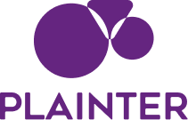

<h1 align="center">
   
</h1>


<h4 align="center">Tenha acesso a mentorias, trilhas de conhecimento personalizadas, comunidades de networking e possibilidade de match com empresas que busquem o seu perfil. Tudo isso, de graça!</h4>


<p align="center">https://plainter.netlify.app/ </p>


# Getting started

Este projeto foi desenvolvido durante o Hackaton CCR, onde criamos a Plainter: uma plataforma que conecta jovens que necessitam de um direcionamento com mentores voluntários que já estão inseridos no mercado de trabalho, e assim, gerando networking.

Em nossa plataforma o jovem será acolhido e direcionado, através de mentorias, sobre sua jornada, como gerar networking e até resoluções de como se preparar para uma entrevista ou coisas do tipo.

Na plataforma, o jovem irá encontrar um perfil onde terão informações sobre seu networking, indicações e mentorias agendadas. Terá também um espaço compartilhado que poderá interagir com outros participantes, lançando e respondendo perguntas. E como foco da plataforma, o jovem poderá registrar seu horário disponível para realizar mentorias, em  seguida um painel irá disponibilizar os dados de cada mentor, sua área e quando estarão disponíveis para o agendamento.

### Pré-requisitos

Para instalar e fazer o build das aplicações é necessario ter instalado as seguintes ferramentas

- NodeJs
- Npm or Yarn
- Angular
- NestJs

### Instalação

Para iniciar a aplicação é necessario usar os seguintes comandos

```sh
$ npm install
$ ng serve
```

## Authors

- **Caroline Silva** - Contributor - [caabeatriz](https://github.com/caabeatriz)
- Daniela
- **Sthefany Machado Santos** UX/Contributor - [sthefanysantos](https://www.behance.net/sthefanysantos)
- Mayara 
- Guilherme
- **Luis Fernando** - Contributor - [LuisFrag](https://github.com/LuisFrag)

## License

Usage is provided under the [MIT License](https://mit-license.org/). See LICENSE for the full details.
